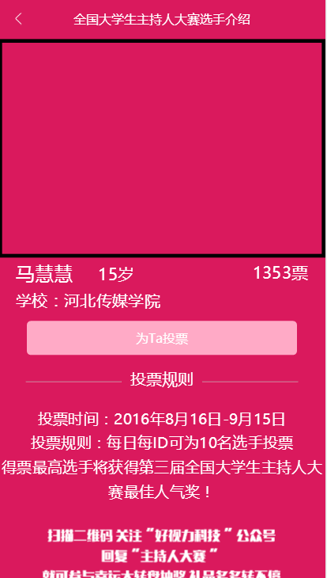

# MobileWeb
##移动Web页面布局实践
1.[主持人大赛首页](https://haha214.github.io/MobileWeb/presenter/home.html)

2.[主持人大赛选手介绍](https://haha214.github.io/MobileWeb/presenter/detail.html)

3.[红包游戏](https://haha214.github.io/MobileWeb/redEnvelope/redEnvelope.html)

4.[华夏之声](https://haha214.github.io/MobileWeb/voice/voice.html)

